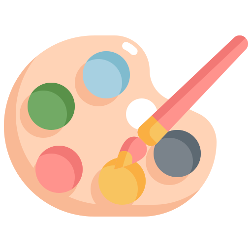

<div align="center">
    <h2> <a href="https://mvpaint.github.io"><span style="color: #FF69B4;">MVP</span><span style="color: #1E90FF;">aint</span>: Synchronized Multi-View Diffusion for Painting Anything 3D</a></h2>

<p align="center">
  <a href="https://mvpaint.github.io/">Project Page</a> •
  <a href="https://arxiv.org/abs/2411.02336">Arxiv</a> •
  <a href="#citation">Citation
</p>

</div>

## MVPaint

<div align="center">

<p><b>MVPaint</b> generates <b>multi-view consistent</b> textures with <b>arbitrary UV unwrapping</b> and <b>high generation versatility</b>.</p>
</div>


<details>
<summary><b>Introducing MVPaint</b></summary>
    <br></br>
    <div align="center">
    
    </div>
    <br></br>
    Texturing is a crucial step in the 3D asset production workflow, which enhances the visual appeal and diversity of 3D assets. Despite recent advancements in generation-based texturing, existing methods often yield subpar results, primarily due to local discontinuities, inconsistencies across multiple views, and their heavy dependence on UV unwrapping outcomes. To tackle these challenges, we propose a novel generation-refinement 3D texturing framework called <b>MVPaint</b>, which can generate high-resolution, seamless textures while emphasizing multi-view consistency. MVPaint mainly consists of three key modules. <b>1) Synchronized Multi-view Generation (SMG).</b> Given a 3D mesh model, MVPaint first simultaneously generates multi-view images by employing a SMG model, which leads to coarse texturing results with unpainted parts due to missing observations. <b>2) Spatial-aware 3D Inpainting (S3I).</b> To ensure complete 3D texturing, we introduce the S3I method, specifically designed to effectively texture previously unobserved areas. <b>3) UV Refinement (UVR).</b> Furthermore, MVPaint employs a UVR module to improve the texture quality in the UV space, which first performs a UV-space Super-Resolution, followed by a Spatial-aware Seam-Smoothing algorithm for revising spatial texturing discontinuities caused by UV unwrapping. Extensive experimental results demonstrate that MVPaint surpasses existing state-of-the-art methods. Notably, MVPaint could generate high-fidelity textures with minimal Janus issues and highly enhanced cross-view consistency.

</details>


## News

- [2025/07/29] Release a preliminary version for testing; a better-organized version will be published as soon as possible in a few weeks. 
- [2024/10/31] Upload paper and init project.


## Installation

``` bash
### environment for preprocessing, stage_1_low_res and final visualization
sh env_mvdream.sh 

### environment for stage_1_high_res and stage_2_3
sh env_syncmvd.sh 
```

## Demo
The script needs to download multiple pretrained models from **Hugging Face**, which may take time to complete during the first run.

Our pretrained model could be found <a href="https://www.dropbox.com/scl/fo/c7w4aldz60v22rvu911p1/AP1DbOdOhKmJfy2tVM_XKYc?rlkey=as0rok9eizfdjuxr4mamz1m0n&st=9nqhcmdm">here</a>.

We provide a sample mesh under the `./samples` folder. You can use it to quickly test the script and verify its functionality.

``` bash
### please modify paths in run_pipeline.sh, they are:
### CODE_ROOT, CKPT_PATH, SAMPLE_DIR, prompt_file, OUT_ROOT
sh run_pipeline.sh 
```

## Citation

If you find our code or paper helps, please consider citing:

```bibtex
@inproceedings{cheng2025mvpaint,
  title={Mvpaint: Synchronized multi-view diffusion for painting anything 3d},
  author={Cheng, Wei and Mu, Juncheng and Zeng, Xianfang and Chen, Xin and Pang, Anqi and Zhang, Chi and Wang, Zhibin and Fu, Bin and Yu, Gang and Liu, Ziwei and others},
  booktitle={Proceedings of the Computer Vision and Pattern Recognition Conference},
  pages={585--594},
  year={2025}
}
```

## Acknowledgments

Thanks to these amazing works which MVPaint is built upon: [MVDream](https://github.com/bytedance/MVDream), [SyncMVD](https://github.com/LIU-Yuxin/SyncMVD) and [Paint3D](https://github.com/OpenTexture/Paint3D)
